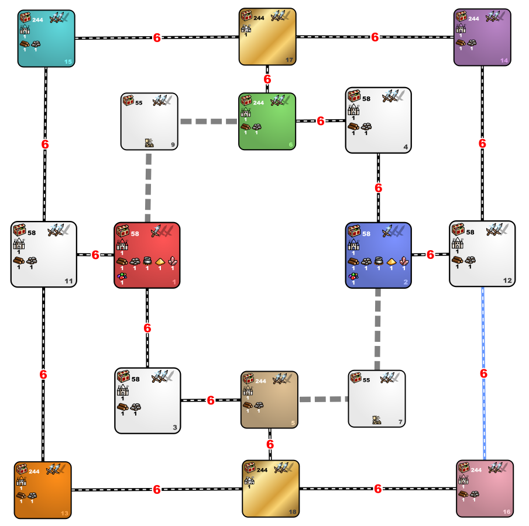

[<<-home](../..)

## 8lu6tp

[Download 8lu6tp](./8lu6tp.zip)

### Description
This L+U template is inspired on original templates from standard pack (with spell pool which guarantee tp from 0-4 rolls in guild)

### Recommended settings
* Map size: L+U
* Player count: 2
* AI players: 6
* Teams: none
* Water: none
* Monsters: strong
* Difficulty: 160%
* Chess timer: 19+8+2
* Roads: medium
* Sim turns: yes, 117
* Additional rules:
    * The early encounter restart is disabled.
    * Each player has only a single day 1 (2x111) 2 subjective restart available or a day 2 (1x111).
	* The castles are chosen by players with standard barter or elimination. Next, the players select the castles for the AI players (their neighbors on the template). Red selects Tan, Orange and Teal. Blue selects Green, Purple and Pink. The castles for AI players are selected by human players in turns (from the list of remaining castles). Blue player is the first to start selecting. All starting castles must be different. Before the start of the game, the player that creates the game sets the AI player castles.

### Template specifications

