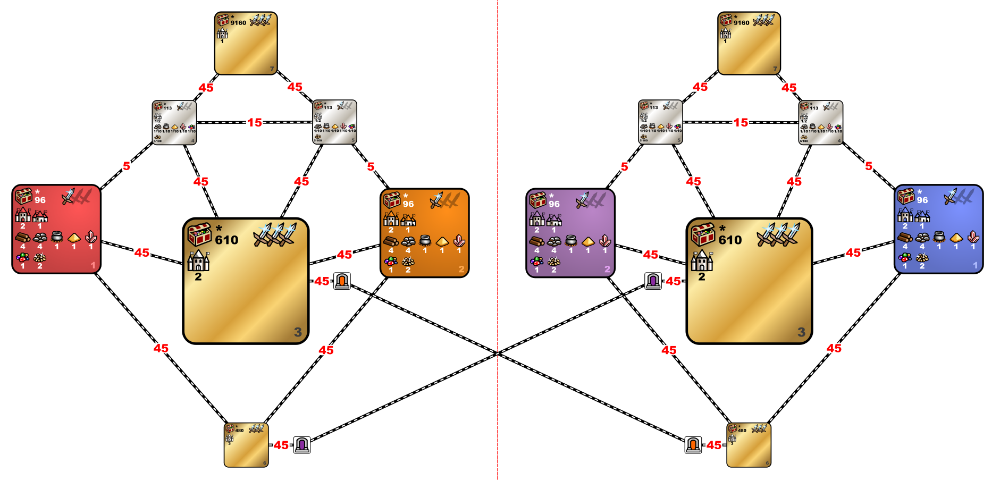

---
title: mt_Firewalk 1.7
---

[<<-home](../..)

## mt_Firewalk 1.7a

[Download mt_Firewalk 1.7a](./mt_Firewalk_1_7a.zip)

### Changes from last version (1.7)
* fix Confluxes in gold zones without AI

### Description
This template is focused on highly dynamic game. Player starting zones contain 3 towns and are very rich, but with some custom rules: 1 dwelling of 7th level and 2 dwellings of 6th level, and Pandora’s boxes with experience, are always present; Dragon Utopias and banks which give creatures in reward are forbidden. The connection to white zone is worth opening soon: there the big piles of gold, banks with gold in reward and a Conflux village can be found. Besides white zone, there are 3 treasure zones present on the template: “Creature Bank zone”, “Big Sand zone” and “Dragon Utopia zone”.

### Recommended settings
* Map size: XL+U (recommended) or L+U
* Player count: 2 (recommended) or 4
* AI players: 0
* Teams: none (recommended) or (red + tan vs blue + green)
* Water: none
* Monsters: strong
* Difficulty: 130%
* Chess timer: 20+8+2
* Roads: fast
* Sim turns: yes, 117
* Additional rules:
    * The early encounter restart is disabled.
    * Each player has only a single day 1 (1x111) subjective restart available.
    * Allowed artifacts: Orb of Inhibition and Recanter’s Cloak.
	* Player starting zone is his first opened zone.
	* Player open guarded zone by defending PG to specific zone.
	* Player gain all opened zones of other player from the moment when both opened same zone.
	* It is permitted to move between opened zones without any limitations.
	* It is permitted to use Dimension Door spell to teleport to square of guarded zone near PG and immediately attack it.

### Template specifications

* Map size: XL+U (underground will be a copy of the surface layer)
* Zones 1 is the player starting zone.
	* Zone have 2 Castles and 1 Town, all are same fraction as Player and belongs to Player from beggining
	* Zone contains 2 internals portals inside zone, unguarded. 
    * Treasure values: (300-3000, 10), (5000-16000, 6), (12000-22000, 1)
    * Terrain is corresponding to the towns chosen by the players.
    * The following objects should always spawn in this zone:
        * Dwellings of level 7 - 1 time
        * Dwellings of level 6 - 2 times
    * The following objects are banned in this zone:
        * All banks with army reward (Griffin conservatory, Red tower...)
		* All pandora boxes except pandora boxes with experience
		* Dragon utopias
		* Spell scrolls with control
		* Warrior tomb
		* Refugee camp
		* Quest artifact for seer hunt
	* The following objects have modified frequency
		* Pandora box with 5000 experience (100 frequency)
		* Pandora box with 10000 experience (50 frequency)
	* The following objects have spawn max limit:
		* Library of Enlightenment - 1
		* Mercenary Camp - 5
		* Marletto Tower - 5
		* Star Axis - 5
		* Garden of Revelation - 5
		* School of War - 5
		* Arena - 3
		* Colosseum of the Magi - 3
* Zones 2 is the treasure/AI/second player starting zone.
	* It has same settings as Zone 1, it always has same city and terrain as Zone 1	
* Zone 3 is the big sand zone.
    * Terrain is always sand.
	* Zone have 2 Castles
    * The following objects are banned in this zone:
        * All banks with army reward (Griffin conservatory, Red tower...)
		* All pandora boxes except pandora boxes with 15k or 20k experience reward
		* All dwellings
		* Dragon utopias
        * 2 Dwellings of level 6
		* Imp Cache, Mansion, Dwarven Treasurey, Naga Bank, Medusa Stores
		* Gold, Treasure Chest
	* The following objects have spawn max limit:
		* Library of Enlightenment - 5
		* Prison - hero with 0 xp - 6
		* Pandora box with 10000 experience (50 frequency)
* Zone 4 is the gold zone.
    * Terrain is always dirt.
	* Zone have 1 Conflux Town
	* Treasure values: (100-100, 1), (3500-3500, 30), (300-3000, 5)
	* Every object which is not enabled is banned in this zone
    * The following objects are enabled in this zone with default frequency:
        * Wood, Ore, Mercury Sulfur, Crystal, Gems, Gold, Random Resource, Treasure Chest, Campfire
	* The following objects have spawn max limit:
        * Water Wheel - 3
		* Mystical Garden - 3
		* Wagon - 3
		* Lean To - 3
		* Churchyard - 3
		* Crypt - 3		
	* The following objects have changed value, frequency and spawn max limit:
		* Naga bank - value:3500, frequency:10000, spawnMaxLimit:3
		* Dwarven treasury - value:3500, frequency:10000, spawnMaxLimit:3
		* Imp Cache - value:3500, frequency:10000, spawnMaxLimit:3
		* Medusa Stores - value:3500, frequency:10000, spawnMaxLimit:3
		* Trading Post - value:500, frequency:10000, spawnMaxLimit:3
		* Stables - value:500, frequency:10000, spawnMaxLimit:2
* Zone 5 is the second gold zone.
	* It has same settings as Zone 3
* Zone 6 is the army bank zone.
    * Terrain is always lava.
	* Zone have 3 random Towns
	* Treasure values: (7900-8100, 20)
	* Every object which is not enabled is banned in this zone
    * The following objects are enabled in this zone with default frequency:
        * Wood, Ore, Mercury Sulfur, Crystal, Gems, Gold, Random Resource	
	* The following objects have changed value, frequency and spawn max limit:
		* Griffin Conservatory - value:8000, frequency:10000, spawnMaxLimit:4
		* Red Tower - value:8000, frequency:10000, spawnMaxLimit:4
		* Experimental Shop - value:8000, frequency:10000, spawnMaxLimit:4
		* Wolf Raider Picket - value:8000, frequency:10000, spawnMaxLimit:6
		* Dragon Fly Hive - value:8000, frequency:10000, spawnMaxLimit:6
* Zone 7 is the utopias zone.
    * Terrain is always sand.
	* Zone have 1 random Town
	* Treasure values: (7900-8100, 20), (45000-45000, 100)
	* Every object which is not enabled is banned in this zone
    * The following objects are enabled in this zone with default frequency:
        * Wood, Ore, Mercury Sulfur, Crystal, Gems, Gold, Random Resource	
	* The following objects have changed value, frequency and spawn max limit:
		* Dragon Utopia - value:45000, frequency:10000, spawnMaxLimit:6
* Unless specified in the zone's description, the following objects are disabled:
    * Prisons
* Enabled Artifacts:
	* Recanter's Cloak
	* Orb of Inhibition
* Banned Heroes
    * Castle: 
    * Rampart: Kyrre
    * Tower: Solmyr
    * Necropolis: Aislinn, Thant 
    * Dungeon: Gunnar, Alamar, Jeddite, Deemer
    * Stronghold: Dessa
    * Conflux: Luna, Labetha, Grindan
    * Cove: Miriam
* Enabled Heroes
    * Castle: Roland
    * Necropolis: Haart Lich
    * Dungeon: Murate Drake, Mutare
    * Stronghold: Boragus
* Combat turn limit: 100