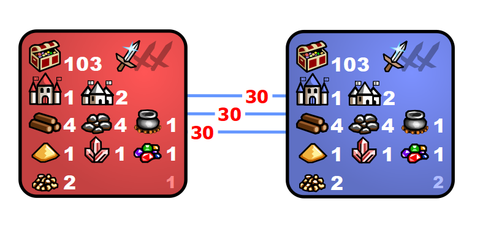

---
title: mt_Speedrun 1.0b
---

[<<-home](../..)

mt_Speedrun 1.0b

[Download mt_Speedrun 1.0b](./mt_Speedrun_1.0b.zip)

### Description
This template is focused on fast contact with other player game. There are 3 tp's to the other side t1-t3, t3-t2, t2-1.

### Recommended settings
* Map size: M
* Player count: 2
* AI players: 0 
* Teams: none
* Water: none
* Monsters: strong
* Difficulty: 160%
* Chess timer: 20+8+2
* Roads: medium
* Sim turns: yes, 117
* Additional rules:
    * The early encounter restart is disabled.
    * Each player has only a single day 1 (1x111) 12 subjective restart available.

### Template specifications

* Map size: XL+U (underground will be a copy of the surface layer)
* Zones 1 is the player starting zone.
    * Treasure values: (300-3000, 10), (5000-16000, 6), (12000-22000, 1)
* Combat turn limit: 100
