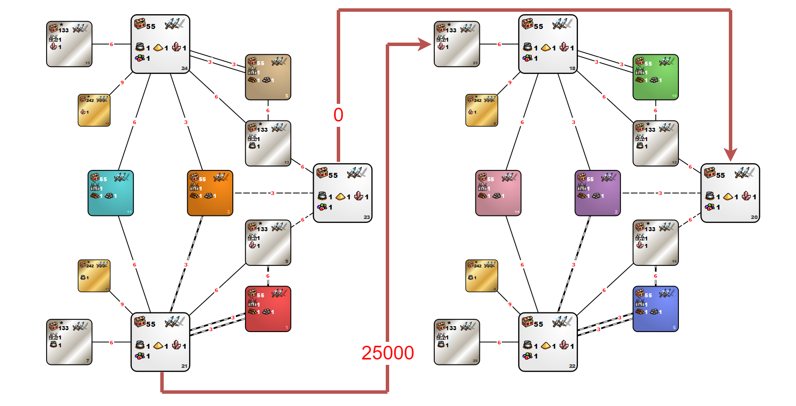

---
title: mt_TryHard
---

[<<-home](../..)

mt_TryHard

[Download mt_TryHard](./mt_TryHard.zip)

### Description
This template is mirrorized version of 6lm10a with disabled spells modifing unit speed and resurrection spells. 
Disabled heroes spells: slow, haste, prayer, animate dead, resurrection
Disabled artifacts: Armor of Wonder (AOTD), Blackshard of the Dead Knight(AA), Targ of the Rampaging Ogre(IOTO)

### Recommended settings
* Map size: XL+U
* Player count: 2
* AI players: 6
* Teams: none
* Water: none
* Monsters: strong
* Difficulty: 160%
* Chess timer: 20+8+2
* Roads: fast
* Sim turns: yes, 117
* Additional rules:
    * Each player has only a single day 1 (1x111) 1 subjective restart available.

### Template specifications

* Map size: XL+U (underground will be a copy of the surface layer)
* All zones have same settings as on 6lm10a
* Disabled artifacts:
	* Blackshard of the Dead Knight
	* Targ of the Rampaging Ogre
	* Armor of Wonder
* Disabled Spells:
	* Resurrection
	* Animate Dead
	* Prayer
	* Haste
	* Slow
* Disabled Heroes:
	* Loynis
	* Kyrre
	* Josephine
	* Fafner
	* Cyra
	* Calid
	* Straker
	* Moandor
	* Sandro
	* Thant
	* Gunnar
	* Alamar
	* Jeddite
	* Geon
	* Dessa
	* Terek
	* Gundula
	* Voy
	* Luna
	* Brissa
	* Labetha
	* Grindan
	* Miriam
	* Andal
	* Kinkeria
	* Ranloo
* Combat turn limit: 100
